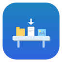

<p align="center">
  
</p>

<h1 align="center">Shelfish</h1>

<p align="center">
  <strong>macOS 用の軽量ファイルシェルフ</strong><br>
  ファイルを画面端にドラッグして一時的に保持し、好きな場所にドロップできます。
</p>

<p align="center">
  
  
  
  
</p>

<p align="center">
  <a href="README.md">English</a>
</p>

---

<!-- TODO: デモ GIF を追加 -->
<!-- <p align="center"></p> -->

## 使い方

1. **ファイルを画面端にドラッグ** — シェルフがスライドして表示されます
2. **シェルフにドロップ** — ファイルが一時的に保持されます
3. **別のアプリやフォルダにドラッグアウト** — 完了、シェルフは自動で非表示になります

<br>

## 機能

| | 機能 | |
|---|---|---|
| :open_file_folder: | **自動表示/非表示** — ドラッグ時にシェルフが現れ、空になると隠れます | |
| :round_pushpin: | **画面端に吸着** — 左・右・上・下から選択可能 | |
| :rocket: | **ログイン時に起動** — launchd で静かに起動 | |
| :ghost: | **目立たない存在** — Dock アイコンなし、メニューバーのみ、フォーカスを奪いません | |
| :feather: | **超軽量** — 約 50KB、依存ゼロ、ファイル参照のみ | |
| :framed_picture: | **アイコングリッド** — ファイルアイコンと名前を一覧表示 | |

<br>

## クイックスタート

1. [Releases](https://github.com/nyanko3141592/shelfish/releases) から最新の `Shelfish-v1.0.0-arm64.zip` を **ダウンロード**
2. **解凍** して `Shelfish.app` を `/Applications` に移動
3. **起動** — メニューバーにアイコンが表示されます。以上！

> [!NOTE]
> このアプリはコード署名されていません。初回起動時はアプリを右クリックして「**開く**」を選択するか、**システム設定 > プライバシーとセキュリティ** で許可してください。

### メニューバーオプション

メニューバーアイコンを右クリックすると：
- シェルフの位置変更（左 / 右 / 上 / 下）
- **ログイン時に起動** の切り替え
- 終了

<br>

## ソースからビルド

**macOS 13 以上** と **Swift 5.9 以上** が必要です。

```bash
git clone https://github.com/nyanko3141592/shelfish.git
cd shelfish
swift build -c release
.build/release/Shelfish
```

<br>

## アーキテクチャ

純粋な Swift/AppKit で構築。Swift Package Manager を使用。XIB、Storyboard、外部依存なし。

```
Sources/Shelfish/
├── main.swift                # アプリのエントリーポイント
├── AppDelegate.swift         # メニューバーアイコン、表示/非表示、設定メニュー
├── EdgePosition.swift        # 端の列挙型（左/右/上/下）+ 永続化
├── LaunchAtLogin.swift       # launchd LaunchAgent 管理
├── ShelfWindow.swift         # コンパクトな端吸着フローティング NSPanel
├── ShelfViewController.swift # ドロップゾーン + アイコングリッドレイアウト
├── ShelfItemView.swift       # ファイルアイコンタイル（ドラッグソース + 削除ボタン）
├── EdgeTriggerWindow.swift   # ドラッグを検知する透明な端ゾーン
└── FileShelfItem.swift       # ファイル参照モデル
```

詳細なアーキテクチャについては [CLAUDE.md](CLAUDE.md) を参照してください。

<br>

## コントリビューション

コントリビューションを歓迎します！Issue を作成するか、プルリクエストを送ってください。

## ライセンス

[MIT](LICENSE)
